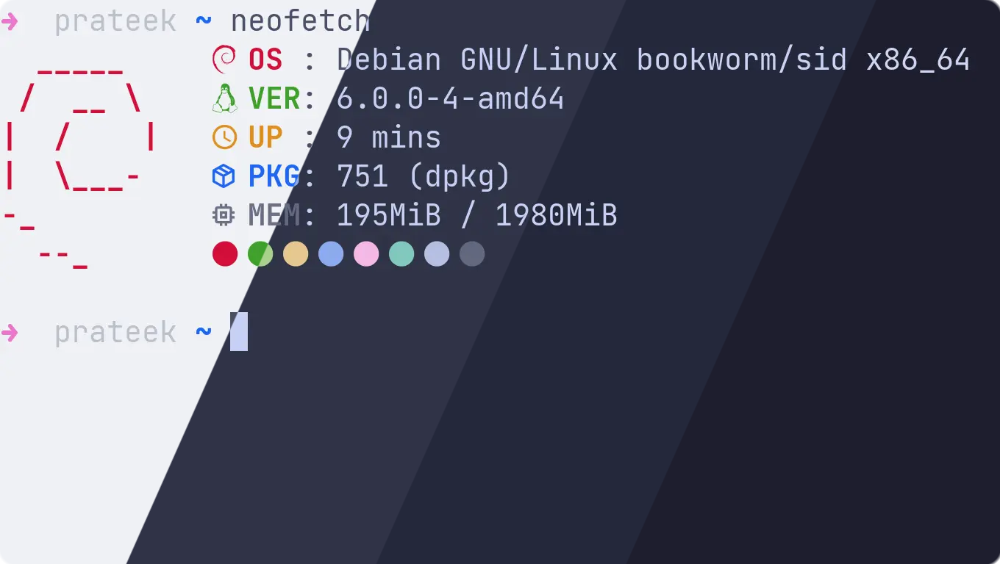
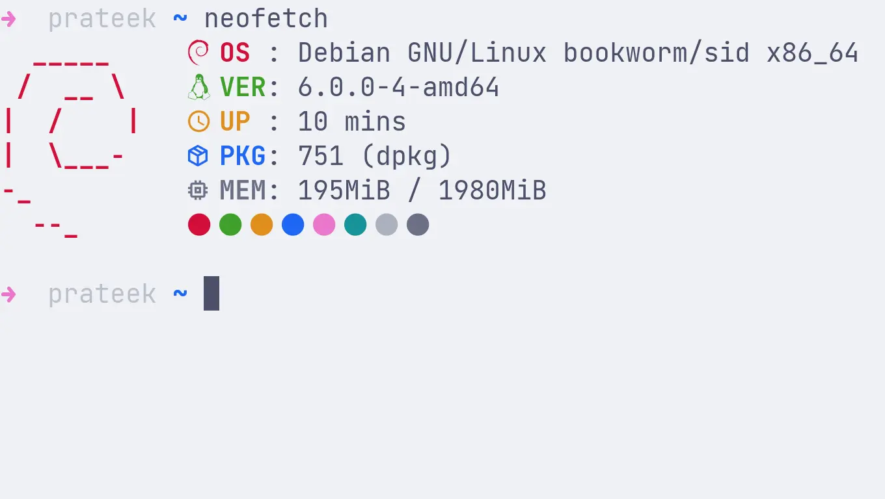
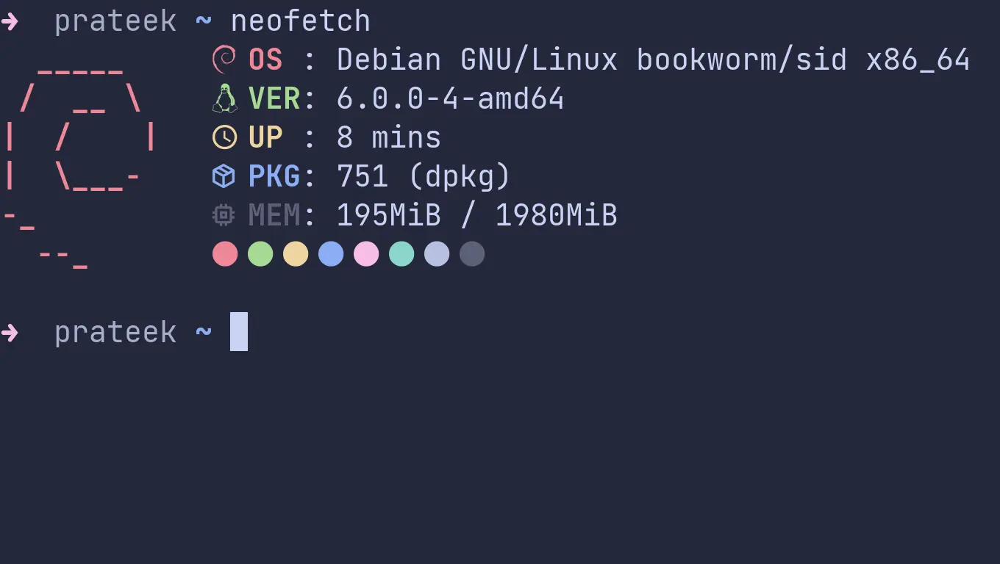
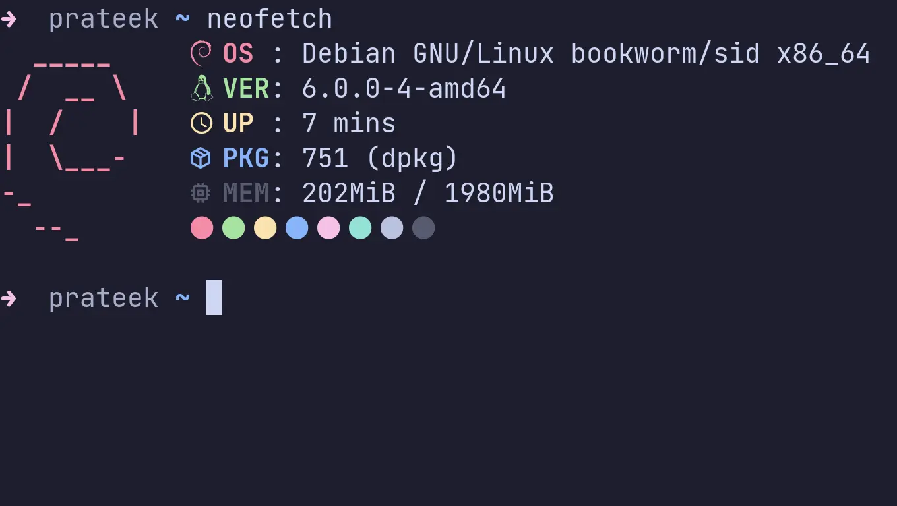

<h3 align="center">
	 
	
	Catppuccin for <a href="https://github.com/lxde/lxterminal">LXTerminal</a>
	
</h3>

	
	
	

	

## Previews

🌻 Latte

🪴 Frappé

🌺 Macchiato

🌿 Mocha

## Usage

1. Browse to the `[general]` section in your active `lxterminal.conf` file and delete the lines corresponding to the color settings, starting from `bgcolor` and ending with `color_preset`.
2. Copy the contents of the flavor of your choice from [`themes/`](./themes/) and paste it inside your active `lxterminal.conf` file.
3. Restart LXTerminal to apply the changes.

## 💝 Thanks to

- [Prateek](https://github.com/prateektade)

&nbsp;

	

	Copyright &copy; 2021-present <a href="https://github.com/catppuccin" target="_blank">Catppuccin Org</a>

	

